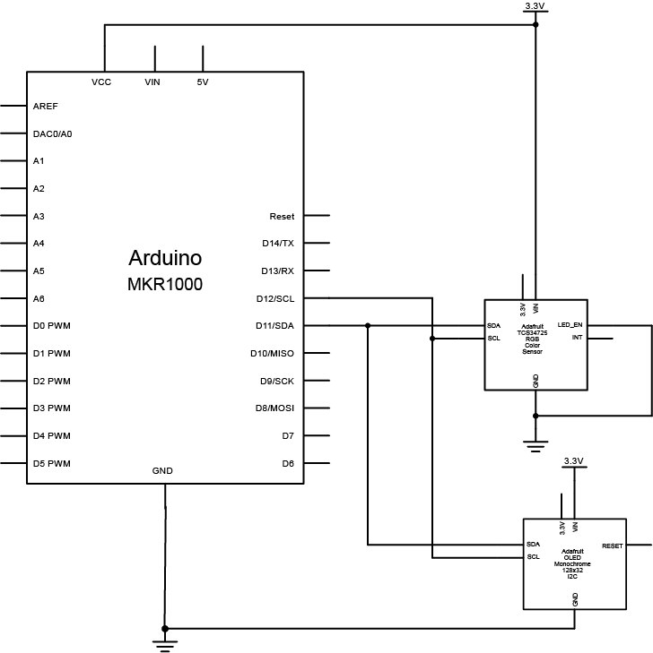

# Philips Hue Control from Arduino

These examples show how to control a Philips Hue hub from An Arduino MKR1000 or MKR1010. 

## Sketches included:

* [ArduinoHTTPClient-example](ArduinoHTTPClient-example/ArduinoHTTPClient-example.ino) Shows how to turn a light on or off.
* [ArduinoHueCT](ArduinoHueCT/ArduinoHueCT.ino) Shows how to change the color temperature on those lights that support CT control. 
* [ArduinoHueCTWithSensor](ArduinoHueCTWithSensor.ino) Shows how to change the color temperature on those lights that support CT control using a TCS34725 color sensor.

## Libraries Required

All sketches use these libraries that you can install through the Library manager in the Arduino IDE (filter the library manger for these terms):

* WiFi101 (for MKR1000)
* WiFiNINA (for MKR1010)
* ArduinoHttpClient 

The [ArduinoHueCTWithSensor](ArduinoHueCTWithSensor.ino) sketch uses the following additional libraries:

* Adafruit_TCS34725
* Adafruit_GFX
* Adafruit_SSD1306

## Sensor Sketch Hardware

The [ArduinoHueCTWithSensor](ArduinoHueCTWithSensor.ino) sketch uses a [TCS34725 light sensor]() to read [color temperature](https://itp.nyu.edu/classes/light/lighting-terminology/) and [illuminance](https://itp.nyu.edu/classes/light/lighting-terminology/) values and an [SSD1306 OLED display](https://www.amazon.com/s/ref=nb_sb_ss_i_5_7?url=search-alias%3Delectronics&field-keywords=ssd1306+128x32&sprefix=ssd1306%2Celectronics%2C177&crid=2R13HKELDMJP1) to display the result. Once the color temperature value is determined, it's converted to a [mired value](http://cbkmrks.blogspot.com/2013/03/color-temperature-mired-scale-dailey.html) and used to control Philips Hue color lamps. To control the Hue, the sketch makes an HTTP PUT call to the Hue Hub.

To make this work, you need to know your Hue hub's IP address and your username on the hub.

Figures 1 and 2 below show the circuit. The sensor and the display are connected to the MKR1000's I2C bus. Connect the SPI pins of all three together, and the I2C pins of all three together as well. Connect the sensor's and dispoay's voltage inputs to the Vcc output from the microcontroller, and connect all the grounds together. Connect the sensor's LED pin to ground as well, since it is not used.

Images made in Fritzing and Illustrator CS.

_Figure 1.Breadboard view of MKR1000, TCS34725, and SSD1306 OLED display_

_Figure 2. Schematic view of MKR1000, TCS34725, and SSD1306 OLED display_
