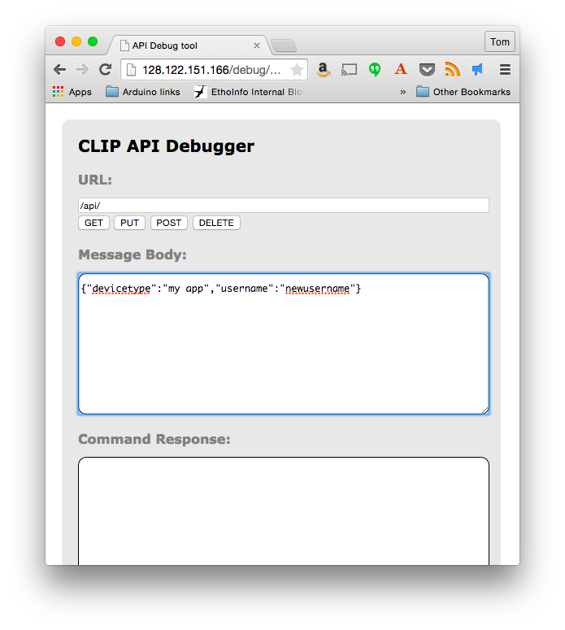

# Controlling the Philips Hue Hub

Philips [Hue lighting system](http://www2.meethue.com/en-us/) allows you to control the lighting in your home from a mobile app, or from any application you write yourself that can connect to the internet. The center of the system is the Hue hub, an Ethernet-connected device that communicates with compatible lamps through the [ZigBee HA](http://www.zigbee.org/zigbee-for-developers/applicationstandards/zigbeehomeautomation/) radio protocol. Philips makes a range of Hue-compatible lamps, and the [GE Link lamps](http://gelinkbulbs.com/) also work with the Hue system. Each Hue hub is its own HTTP web server, and can be controlled using the [Hue REST API](http://www.developers.meethue.com/). There are libraries to control the Hue available in many programming languages. The tutorials here are all in client-side JavaScript using [P5.js](http://p5js.org/), or server-side using [node.js](https://nodejs.org/), or micrcontroller-based for [Arduino](http://www.arduino.cc).

## Useful Tools

To get started programming Hue apps, you'll need access to a Hue hub. You'll want a [Hue account](https://my.meethue.com/en-us/) too.  Keep the [Hue Developers Site](http://www.developers.meethue.com/) link handy.

The Hue app for [Android](https://play.google.com/store/apps/details?id=com.philips.lighting.hue&hl=en) or [iOS](https://itunes.apple.com/us/app/philips-hue/id557206189?mt=8) is helpful when developing, because it works when your app doesn't yet.

Every Hue has a debug interface, available at

    http://my.hub.ip.address/debug/clip.html

Replace my.hub.ip.address with your hub's IP address. When you're developing, you can use this to send API command to the hub to test things out.

Bookmark the full [Hue API documentation](http://www.developers.meethue.com/philips-hue-api) You'll need to log in for this, but it's very well documented.

Peter Murray's [node-hue-api library](https://github.com/peter-murray/node-hue-api) for node.js is the best of the various client-side JavaScript libraries I've tested for controlling the Hue.

Other than these, you'll need to know some HTML and JavaScript, and a text editor, a command line interface, and a browser to try the examples on this site.

## Connecting To Your Hub

Your app will need to be identified to your hub using a unique username. Follow the developer site's [Getting Started instructions](http://www.developers.meethue.com/documentation/getting-started) to add a new app/username to your hub. Here they are in brief:

Open a browser and connect to the hub's debug interface:

    http://my.hub.ip.address/debug/clip.html

In the URL field, enter:

    /api

And in the Message Body, enter

    {"devicetype":"my app", "username":"newusername"}

You can use any value you want for devicetype or username, but username must be at least ten characters.

Press the link button on the hub and click POST. You should get a response like this:

    [
    	{
    		"success": {
    			"username": "newusername"
    		}
    	}
    ]

Now you're ready to write code for your hub. Regardless of what environment you're programming in, you'll use the username you established here.

## Other Features of the Debug Clip Interface

The debug clip interface can be used to send any API command to your hub. The general query string is as follows:

    /api/username/command

Generally, querying the state of the device is done using GET commands, and changing them is done using PUT. For example, to query the state of all your lights, enter the following in the URL field:

    /api/username/lights

 And click GET. To query the configuration, enter:

     /api/username/config

And click GET.  To turn on light 1, enter the following in the URL field:

    /api/username/lights/1/state

And enter the following in the Message Body field:

    {"on":true}

And click PUT. The light should come on, and the hub should reply:

	[
		{
			"success": {
				"/lights/1/state/on": true
			}
		}
	]

For more on the Hue API, see the [Hue Getting Started guide](http://www.developers.meethue.com/documentation/getting-started),  the [Hue API Core Concepts](http://www.developers.meethue.com/documentation/core-concepts), and the full [Hue API documentation](http://www.developers.meethue.com/philips-hue-api) (you'll need to log in for this).

## Adding a Hub to a MAC Address-Filtered Network

The network at the school where I teach is not an open DNS network; instead, all devices must be pre-registered using their MAC address. You can find the MAC address on the bottom of your hub. It's a six-byte number in hexadecimal notation like so:

    00:17:88:0B:14:48

Enter this address in whatever registration interface your network requires, then wait a few minutes and your hub should have an IP address. To check for it, make sure your computer is on the same network, open a command line interface (like Terminal in OSX) and type:

    $ ping -c 5 xxx.xxx.xxx.255 

Where xxx.xxx.xxx are the first three numbers of your network. For example, on a network whose router is 172.16.130.1, you'd enter 172.16.130.255. You'll get a  list of responses, as devices on the network respond to your ping requests.  When it's done, type:   

    $ arp -a

**NOTE**: for this to work, your computer needs to be on the same local network as your Hue hub. That means that to use this method of searching, your laptop has to be on the same wired network as the hue hub. You might need a USB or thunderbolt-wired ethernet adapter to sniff out the hubs using arp, if your wireless network is not the same local net as your wired network (this is the case in many universities and larger institutions).

You'll get a list of all the devices on the same network that your computer can see. Look for the one that matches the MAC address of your hub, and the IP address next to it will be your hub's IP address, like so:

    $ arp -a
	? (192.168.0.1) at ac:b7:16:61:e3:77 on en0 ifscope [ethernet]
	? (192.168.0.3) at 00:17:88:0B:14:48 on en0 ifscope [ethernet]
	? (192.168.0.255) at ff:ff:ff:ff:ff:ff on en0 ifscope [ethernet]

In this case, the hue's IP address is 192.168.0.3.

### An Alternative To The ping and arp Method

Alternatively, if you are on MacOS, the [Discovery app](https://itunes.apple.com/us/app/discovery-dns-sd-browser/id1381004916?mt=12) does a good job of finding Hue Hubs on a network. 

## Adding a Lamp to a Hub

You can add lamps to the hub using the regular mobile Hue app. You can also do it from the debug clip interface using a GET request on the following URL:

    /api/username/lights/new

## Deleting a Lamp from a Hub

You can delete a lamp from a hub from the debug clip interface using a DELETE request on the following URL:

    /api/username/lights/1

Replace 1 with the number of the light you wish to delete.

## Capturing a Lamp From Another Hub

To re-capture a lamp that has been previously connected to a different hub, do the following:

Place the lamp close to the hub with which you want to control it (closer than 30cm, or 1 ft). Turn off all other lamps connected to the hub, or make sure they're much further away than the one you want.

Send the following the debug clip interface using a PUT request:

    /api/username/config/

In the body of your request put:

    {"touchlink": true}

The lamp should blink a few times, and theserver will respond with a success message. You can now add the lamp as usual.

## Adding GE Link Lamps to the Hue

You can add [GE Link lamps](http://gelinkbulbs.com/) to the Philips Hue as well, since they communicate using the same ZigBee protocol. To do this, turn the Link lamp on and connect it just as you would a regular Hue lamp. It will show up as _Dimmable Lamp 1_. You'll only be able to control brightness.

### Resetting GE Link Lamps

If you can't connect a GE Link lamp to your hub, you might need to reset the lamp. To do this, turn the lamp on for three seconds, then off for three seconds. Repeat this several times until the lamp dims down and blinks once. The lamp is now reset. Try to connect again.

For more on the GE Link lamps, see their [install guide](http://gelinkbulbs.com/downloads/GELinkInstallGuide.pdf).

## Further Reading

* [Client-Side Programming of the Hue Hub](client-programming.md)
* [Server-side Programming of the Hue Hub](server-programming.md) in node.js
