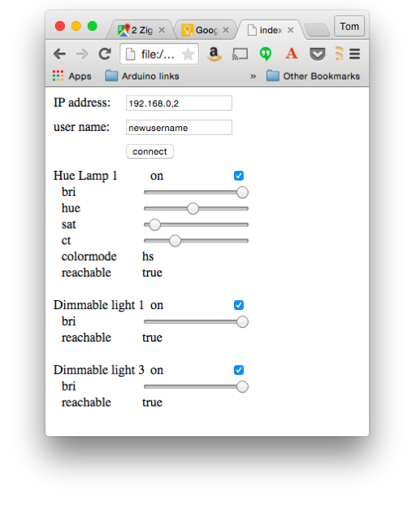

# Client-Side JavaScript Programming for the Philips Hue

Since all of the Hue commands are HTTP requests, you can build browser-based interfaces for it in JavaScript. In [this example](client-example/), I used both P5.js and jQuery to show how the calls could be made with either one. (_also note: at the time of this writing, P5.js' HttpDo() command was not working properl with PUT requests. I expect this will be resolved shortly_). 

For a deeper understanding of the Hue API, see the [API documentation](http://www.developers.meethue.com/philips-hue-api) on the developers site. 

Here's a screenshot of the example:



The hue that this screenshot is from is controlling one Hue lamp and two GE Link lamps. You can see that the controls are different because the GE Link lamps have fewer features.

## Hue Light State

In order to control lamps through the Hue, you need to understand the Hue light states. You can get this by querying the hub as follows:

    http://your.hub.ip.address/api/newusername/lights
    
The hub will respond with the data on all the lights. Here's one light:

```js

    {
      "1": {
        "state": {
          "on": false,
          "bri": 254,
          "hue": 30181,
          "sat": 14,
          "effect": "none",
          "xy": [
            0.3791,
            0.379
          ],
          "ct": 248,
          "alert": "none",
          "colormode": "hs",
          "reachable": true
        },
        "type": "Extended color light",
        "name": "Hue Lamp 1",
        "modelid": "LCT001",
        "manufacturername": "Philips",
        "uniqueid": "00:17:88:01:00:fb:17:88-0b",
        "swversion": "66009663",
        "pointsymbol": {
          "1": "none",
          "2": "none",
          "3": "none",
          "4": "none",
          "5": "none",
          "6": "none",
          "7": "none",
          "8": "none"
        }
      }
    }

```

The state object of each light is the part you will manipulate in your code. The [client example](client-example/client-control.js) starts by making this same request for all the lights, then iterating over the result to pull out the light's state in the `getLights()` function. Then it iterates over the state and creates a control for the properties you'd want to control in the `createControl()` function. 

For example, here's the state of the light above:

```js
        "state": {
          "on": false,
          "bri": 254,
          "hue": 30181,
          "sat": 14,
          "effect": "none",
          "xy": [
            0.3791,
            0.379
          ],
          "ct": 248,
          "alert": "none",
          "colormode": "hs",
          "reachable": true
        }

```

The properties that `createControl()` creates controls for are `on`, `bri`, `hue`, `sat`, `ct`, `colormode`, and `reachable`. The last property tells you whether the hub can contact the light in question. If you've turned off the power to a light, the hub will still know it exists, but not be able to reach it or control it. 

When you want to change one of these properties for a given light, you don't have to send the whole object, you can just send the property you want to change in a PUT request. For example, to change the brightness on light number 2, you'd make a PUT request for 

    http://your.hub.ip.address/api/newusername/lights/2/state
    
In the body of your request, you'd send:

```js

    { "bri": 127 }

```

Each of the input controls created by `createControl()` calls the same callback, `setLight()`, sending the light number and the change to be made. For example, the brightness input slider calls `setLight()` whenever the mouse is released on the slider handle, sending the property name and value as a JSON object. When the hub responds, setLight() calls `getLights()` again to refresh all of the controls.  

That's really all there is to it. Using this same approach, you can query and change groups, schedules, scenes, and sensors as well. For details of those properties, see the [API documentation](http://www.developers.meethue.com/philips-hue-api) on the developers site. 